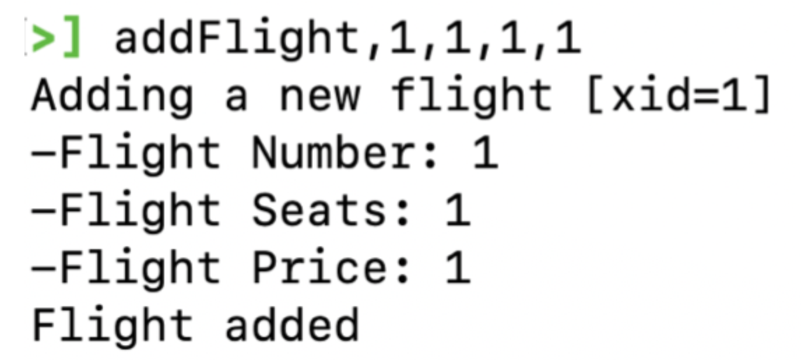
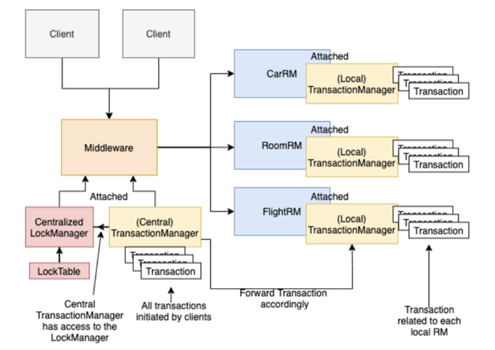
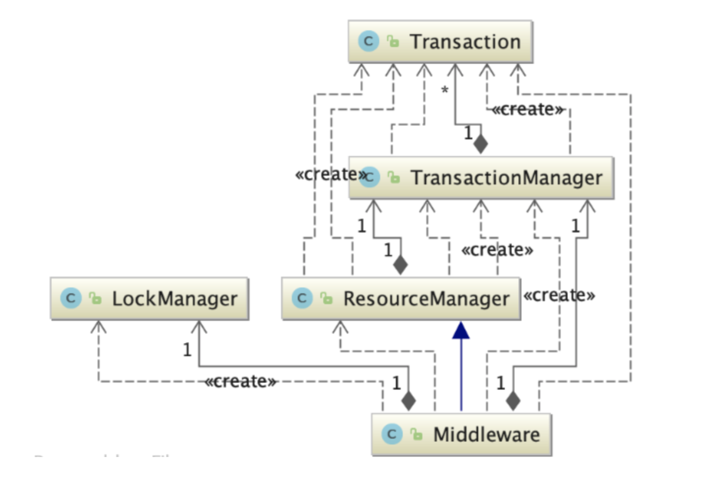

# Distributed-system
Travel Reservation system
This is a school project from COMP512 in McGill University. Basic template are provided by McGill Uiveristy and University of Washington.

Table of Contents

1. Overview of the Project
2. Getting Started
3. Project Architecture 
4. Speed Analysis


### Overview of the Project

The project is a Travel Reservation system where multiple customers can reserve flights, cars, and rooms for their vacation. Each type of item, such as flight, will be handled by an individual server. Distributed transactions and concurrency control are implemented to allow customers to access the items safely. 


### Getting Started

In order to start the servers for the item need to run the RMI resource manager. 

To run the RMI resource manager:

```
cd Server/
./run_server.sh [<rmi_name>] [<port number>] # starts a single ResourceManager, ex. ./run_server.sh Cars 3124 
./run_servers.sh # convenience script for starting multiple resource managers
```


RMI client represents the individual customer.

To run the RMI client:

```
cd Client
./run_client.sh [<server_hostname> [<server_rmi_name>]]
```

Customer command example

````
addFlight, <xid>,<FlightNumber>,<NumberOfSeats>,<PricePerSeat>
````




other command could be find either by 

Prompt Help in the terminal or be find in the Client_UserGuide.pdf


### Project Architecture 



There are three RMIResourceManager for Car, Room and Flight servers respectively. Once established by the user, the proxy for each of the three ResourceManager is exported to the registry for the RMIMiddleware. The RMIMiddleware contains the proxy of the three resource managers and it again exports itself as a proxy object to the clients. When the client makes a request, it looks up the RMIMiddleware object from the registry to send the request. Once receiving the request, the middleware would find the specific ResourceManager to execute the command.


A centralized Lock-Manager (strict 2PL) is implemented and attached to the Middleware to handle object locking globally during each transaction.  Furthermore, a TransactionManager is initialized attached to the Middleware to keep track of all the incoming transactions from the clients.  A local TransactionManager is attached to each of the ResourceManagers as well to keep track of the specific transactions that would interact with the specific ResourceM-anager and stores a temporary copy of the transaction contentat runtime. The central TransactionManager (attached to theMiddleware)  is  responsible  for  forwarding  the  corresponding transactions to the local TransactionManagers and monitoring the life cycle of each transaction.  

The following diagram shows  the high  level view  of the  dependency  among each of the key components in our system.



